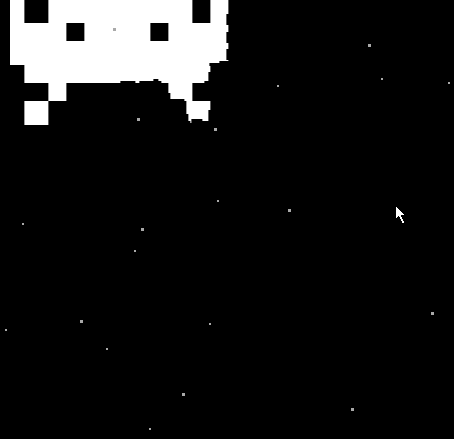

# Space-Invaders

## Contrôles
| Touche | Action                                          |
|--------|-------------------------------------------------|
| q      | Gauche                                          |
| d      | Droite                                          |
| z      | Haut (manic shooter seulement)                  |
| s      | Bas (manic shooter seulement)                   |
| p      | Pause                                           |
| espace | Tirer des super tirs et relancer le jeu         |
| i      | Rendre invincible le vaisseau (debug seulement) |
| b      | Ajouter tous les bonus (debug seulement)        |

## Description du projet 
Ce projet est la réalisation du jeu *Space-Invaders* avec plusieurs ajouts.
La piste suivi est la piste bleu, autonomie de création du jeu.
Les fonctionnalités de bases sont toutes développés et de nombreux ajouts ont été 
- Bonus
  * Bonus de vitesse d'attaque
  * Bonus de puissance d'attaque
  * Bonus de heal
  * Bonus consommable de tir puissant
- Système d'invisincibilité du vaisseau après un dégat
- Système de score
- Particules d'explosion
- Menu de sélection de mode de jeu
- Mode de jeu "manic shooter"

Le mode Manic Shooter est un nouveau mode de jeu qui change complètement l'aspect du jeu.
Pour plus de détails, voici une vidéo qui explique l'origine et les aspects de ce type de jeu: https://www.youtube.com/watch?v=q02XCVp6Ww8
Les principes suivis pour ce mode sont le fait qu'il y a peu d'ennemis et énormément de projectiles qui sont difficiles à esquiver.

Dans le projet, le mode apporte:
 - Possibilités de se déplacer en haut et en bas
 - Mode de jeu sans fin avec un système de vagues d'ennemis
 - Les invaders sont autonomes
 - Le système de projectiles ainsi que les calculs sur les vecteurs sont beaucoup plus complexes pour permettre des patterns projectiles très originaux !
      
 - De nombreux boss avec des comportements différents, et des attaques uniques ! 
   

## Structure du programme

Voici un diagramme UML non exaustif du projet, il présente les aspects principaux et la hierarchie des classes.

Le programme est lancé par **Program**, qui lance le **Menu** de sélection de mode pour lancer la partie.

On peut voir que les 2 classes principales sont **Game** et **GameObject**.
- La classe **Game** s'occupe de de la boucle principal du jeu, et de la gestion des **GameObjects**.
- La classe **GameObject** est le parent de tous les objets du jeu, elle contient les attributs et méthodes qui sont communes à tous les objets, comme **Update()**, **Kill()**, ou encore **Position** et **Speed**

La classe **Ship** (le vaisseau du joueur) et la classe **Invader** sont toutes deux des filles de **LivingEntity**, qui sert à gérer les points de vie. Un **Laser** n'est pas une **LivingEntity** car il est détruit instantanément à chaque collision et ne nécessite pas de vie.

Les classes utilitaires ne sont pas reliés avec les éléments qui les utilisent pour ne pas alourdir le schéma avec des flèches partout, elles sont nottement composés de **TimedAction** et de **Vecteur2D** qui sont très utilisés, et de méthodes d'extensions sur les **List** ou sur **Random**.
L'interface **IImage** est aussi sous-représenté sur ce schéma pour la lisibilité.

## Problèmes rencontrés
### Gestion des trajectoires des balles
Pour rendre le jeu intéressant, il fallait que je puisse faire de nombreuses et différentes trajectoires de balles.
Pour cela, 3 principaux ajouts ont été faits
##### 1 - Physique et accélération
Pour modifier la vitesse d'une balle après sa création, j'ai rajouté un vecteur d'accélération à **GameObject**, celui-ci s'ajoute à la vitesse à chaque appel, de la même manière que la vitesse s'ajoute à l'accélération.

##### 2 - Mouvement délégués
Pour ajouter de nouvelles possibilités comme notamment faire des mouvement de vagues aux balles, j'ai ajouté en paramètre d'une **LaserBall**, la possibilité de passer une fonction delegate, qui modifiera la position de la balle.

##### 3 - Fonctions utilitaires
Toujours dans une optique de rajouter des possibilités de mouvement, j'ai rajouté des fonctions à **Vecteur2D** tel que **Rotate()**, qui permet de modifier la direction d'un vecteur, **FromTargetObject()** qui créer un vecteur ciblant automatiquement un objet, ou **FromAngle()** qui créer un vecteur depuis un angle et une vitesse. Cela facilite énormément la création d'attaques.

### Gestion des vagues
La gestion des vagues a du être beaucoup revisiter pendant le projet, pour avoir un jeu différent à chaque partie mais équilibré. Elle utilise **TimedAction**, qui lui permet de lancer une vague toutes les x secondes. Il y a actuellement 7 vagues prédéfinies dans le jeu, qui sont rangés dans une collection. La solution choisie est de faire 2 listes (une de vagues faciles, une difficile), qui sont mélangés et ensuite concaténer pour obtenir les vagues du jeu.
Un système de verrouillage a aussi été mis en place pour empêcher une vague d'apparaître lorsqu'un boss est en jeu.

### Test et Debug
Il a été difficile de tester tous les boss et debugger sans perdre trop de temps. J'ai principalement modifier le code de génération au fur et à mesure des tests. Il m'a aussi fallu ajouter des actions de debug sont listées [Ici](#contrôles). Une idée d'amélioration serait un fichier json de configuration pour gérer les vagues et autres paramètres.
J'ai aussi créer des units tests pour tester de façon sûr les fonctions de **Vecteur2D**.

## Quelques captures du jeu

